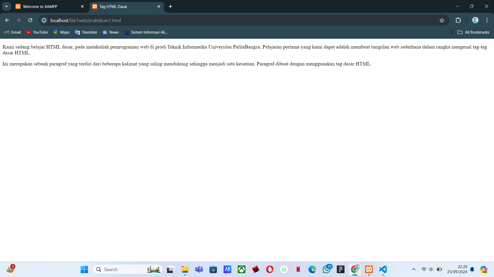
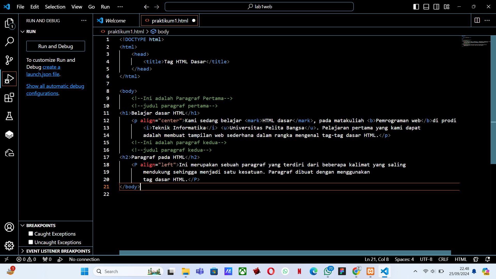
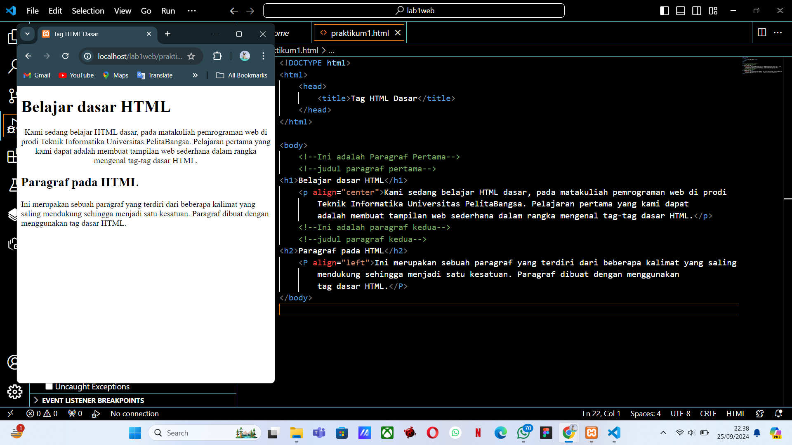

# Lab1web

## 1. Menambahkan file baru praktikum1 dan menambahkan tag dasar dokumen HTML.
- Gambar1

- Gambar2

## 2. Kemudian membuat beberapa paragraf sederhana
- Gambar result

## 3. Kemudian atur atribut paragraf dan menambahkan sub judul
- Gambar 1

- Gambar result 1
